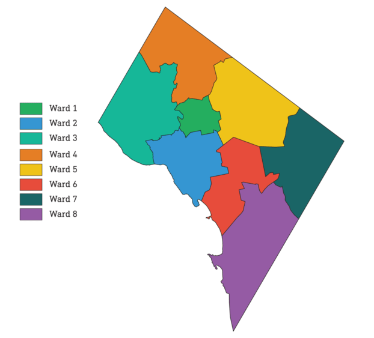

## Case Study Description
**Capital Bike Share** is a well-established bike sharing company based in Washington D.C., offering a comprehensive bike-sharing service that has over 700 stations and a collection of approximately 6000 bikes throughout the metro area. This Company wants to expand their business and increase the number of Cycles to approximately5000 bikes While discussing it on a meeting  with business development team, the challenge arrives, **how and where would they distribute these extra bikes?** Initially they developed some questions on two major key area- **High Bike Usage Location** and **Peak Times/Seasons for Bike Usage** to aid their investigation. 

  1. Which areas or stations has the higher number of bike usage in terms of bike arrival departure?
  2. In which time of the day, people use bikes the most?
  3. Is people’s bike usage varying in season?

## Dataset Description
All the used datasets were downloaded from Capital Bike Sharing Data (https://s3.amazonaws.com/capitalbikeshare-data/index.html) ranging from 2021 June to 2023 June. 

## Data Processing and Visualization
Few pre processing steps were done to estimating the Deperture and Arrival Counts per station in different seasons, different weekdays and different hours of the day.
After that, with the processed dataset, we tried to vizualize it using Tableau and D3.js. Further description of these two outputs can be found in the projects page. 

#### Files Description
* **01_GeoDataVisualization_BikeData_Preprocessing** - Contains the python script for data preprocessing. 
* **02_Capital_BikeSharing_Season&WeekdaysBased_ArrivalDeperture** - Contains the python script for data preprocessing. 
* **03_Capital_BikeSharing_Wards_Stats_Cord_Diagram** - Contain the python script of the cord Diagram
* **Presentation_DataVizualization_CapitalBikeShare** - Contains the pdf presenation of the the whole task, detailed description of different vizualization, what are consdiered while making the visualition and what are the challenges we solved while doing this task. 
* **Tableau_VisualizationDashBoard_CapitalBike** - Contains all the workbook used for creating the Visualization Dashboard. The public version of the Dashboard also can be visualized through this link -https://public.tableau.com/app/profile/tahmida.sarker.muna/viz/QA_CapitalBikeshareWashingtonD_C/Story1

## Outputs

